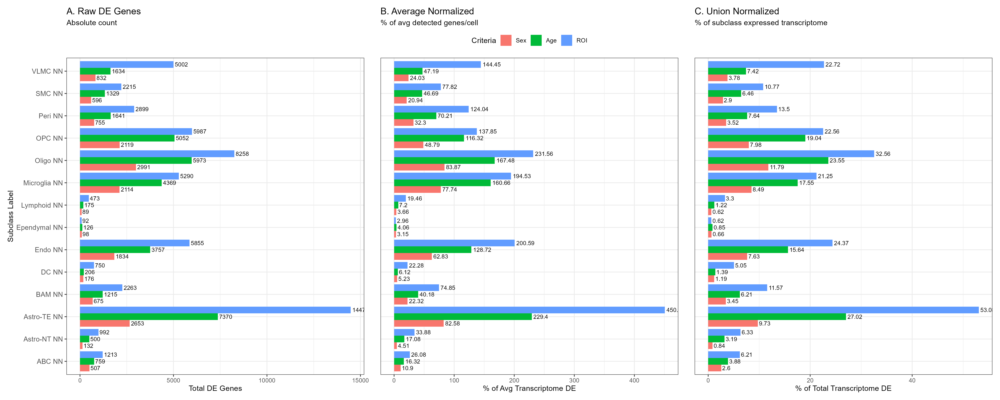
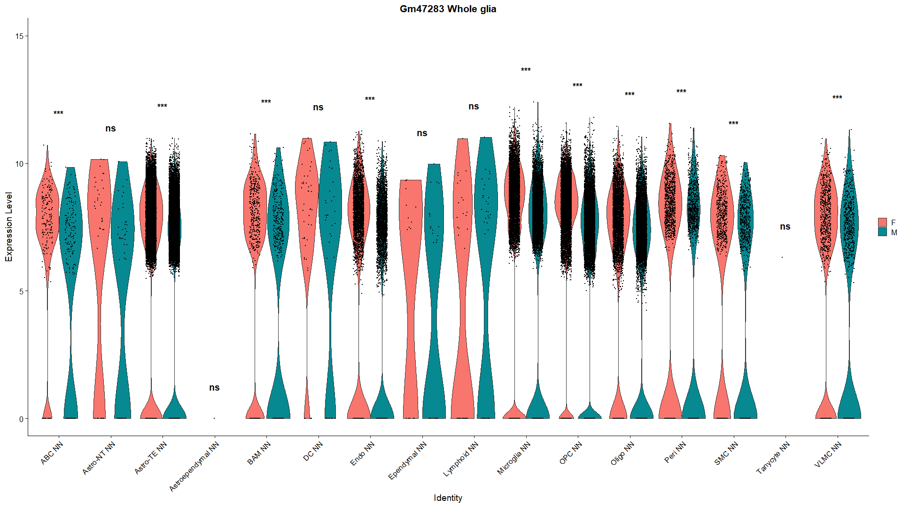

```{=html}
<style>
body {
  font-size: 16px;
}

caption {
  font-size: 14px;
  font-style: italic;
  caption-side: bottom;
}
</style>
```

```{r setup, include=FALSE, echo=FALSE}
knitr::opts_chunk$set(
                      warning = FALSE, # suppressing warning messages
                      message = FALSE,
                      knitr.kable.max_rows = 5)
```

# Introduction

The concept of a "cell type" is a foundational, yet historically ambiguous, classification in biology used to describe populations with distinct functional and phenotypic properties. The advent of single-cell RNA sequencing (scRNA-seq) has revolutionized this paradigm, allowing researchers to quantify transcriptomic snapshots at the individual cell level. However, defining cell types remains a highly subjective computational challenge. Standard workflows heavily depend on manual parameter tuning during algorithmic clustering and subjective bias during annotation. Furthermore, transcriptomic atlases frequently batch-process cells, inadvertently masking how foundational non-transcriptomic variables—such as age, sex, and anatomical region—shape cellular identity. 

Accounting for these variables is particularly critical in neurobiology. While neuronal loss is the pathological hallmark of neurodegenerative conditions like Alzheimer’s disease (AD), growing evidence indicates that non-neuronal cells (microglia, oligodendrocytes, and astrocytes) are primary drivers of disease progression. Under normal physiological conditions, glia maintain brain homeostasis; however, during aging, they frequently transition into dysregulated, neurotoxic states. This transition exhibits profound sexual dimorphism. For instance, females experience more drastic hormonal depletion during aging and possess a significantly higher risk of developing AD, characterized by accelerated volumetric decline in the Hippocampal formation (HPF). At the molecular level, glial populations display distinct sex-specific inflammatory and metabolic transcriptomic signatures. Despite this, sex and age are often deprioritized or regressed out as batch effects in large-scale transcriptomic studies.

Consequently, the initial objective of this study was to critically examine the robustness of the cell-type classifications established in the highly influential murine brain atlas published by Jin et al. (2025). By specifically isolating the non-neuronal population of the HPF, this project aimed to execute a high-resolution re-clustering and differential gene expression (DEG) pipeline to determine if incorporating age and sex as primary analytical axes would reveal novel, state-specific glial subtypes. 

However, the execution of this standard biological pipeline yielded a severe anomaly that necessitated a fundamental shift in the project's scope. The DEG analysis revealed that *Gm47283*, a gene definitively annotated to the Y-chromosome, was significantly upregulated within the female cohort. Because female *Mus musculus* lack a Y-chromosome, this expression profile represents a biological impossibility, assuming the absence of physical sample cross-contamination. Consequently, the focus of this investigation transitioned from biological discovery to computational auditing. This report hypothesizes that the artificial sexual dimorphism observed for *Gm47283* is not a true biological signal, but rather a structural artifact. Specifically, this study proposes that interactions between latent reference genome (GRCm38) misassemblies and the linear read mapping algorithms (STAR) utilized by standard pipelines—which inherently discard multimapped reads—can artificially manufacture differential expression in highly homologous genomic regions.

)](figure/scRNA_seq_pipeline.jpg)

# Objective

* **Biological Variance:** What are the sex- and age-related transcriptomic signatures defining the non-neuronal (glial) populations' identity within the Hippocampal formation (HPF)?
* **The Transcriptomic Anomaly:** Why is *Gm47283*, a Y-linked gene, observed to be significantly upregulated within the transcriptomic profiles of the female *Mus musculus* group?

# Method


## Animal Model

//To be done in report

## Data Source

-    Single cell RNA-seq (scRNA-seq)
-    Original paper: [Jin et al, 2025](https://doi.org/10.1038/s41586-024-08350-8)
-    Deposited in [Neuroscience Multi-omic Data Archive (NeMO)](https://assets.nemoarchive.org/dat-61kfys3)
-    Download url: https://data.nemoarchive.org/other/grant/Mouse_Aging/zeng/transcriptome/scell/10x_v3/mouse/processed/counts/Mouse_Aging_10Xv3_normalized_20241115.h5ad.tar
-    Note: Only Hippocampal formation (HPF) data were subjected to this analysis

[Jin et al (2025)](https://doi.org/10.1038/s41586-024-08350-8) sequenced brain sample collected from 44 aged mice (20 female, 24 male) and 64 young adult mice (31 female, 33 male) using Illumina NovaSeq6000 sequencing system ([Modi et al, 2021](https://doi-org.myaccess.library.utoronto.ca/10.1007/978-1-0716-1099-2_2)) and 10X Genomics CellRanger pipeline (v.6.0.0) to map sequenced reads to `mm10/gencode.vM23` reference genome ([Frankish et al, 2019](https://doi-org.myaccess.library.utoronto.ca/10.1093/nar/gky955)). The raw sequence data contains `2,777,165` cells categorized in 6 major regions, 16 broad regions.

The 6 major regions were:

1. Isocortex
2. Hippocampal formation (HPF)
3. Hypothalamus (HY)
4. Cerebral nuclei (CNU)
5. Midbrain
6. Hindbrain

## Packages Usage

[Seurat](https://satijalab.org/seurat/) ([Hao et al, 2023](https://satijalab.org/seurat/)) was utilized as basic framework, to take advantage of its mature pipeline.

The following table categorized R packages utilization by biological analysis, data visualization, and pipeline utilities within this project based on their primary functionality.

| Category | Package | Version | Description | Reference |
| :--- | :--- | :--- | :--- | :--- |
| Analytical | `Seurat` | *5.4.0* | Basic framework for data management, Differential Gene Expression (DEG) analysis, and Umap visualization | [Hao et al, 2023](https://satijalab.org/seurat/) |
| Analytical | `scrattch.bigcat` | *0.0.1* | Initially selected for clustering, the same package utilized by [Jin et al, 2025](https://doi.org/10.1038/s41586-024-08350-8). **Note:** Utilization was unsuccessful due to limited documentation and local compatibility issues. | Unpublished; [github](https://github.com/AllenInstitute/scrattch.bigcat) |
| Analytical | `scrattch.hicat` | *1.0.0* | Alternative clustering package utilized; selected for superior documentation. | Unpublished; [github](https://github.com/AllenInstitute/scrattch.hicat) |
| Analytical | `Presto` | *1.0.0* | Fast implementation of Wilcoxon Rank Sum test | [Nathan & Raychaudhuri, 2019](https://doi.org/10.1101/653253) |
| Visualization | `ggplot2` | *4.0.1* | Exploratory Data Analysis (EDA); visualization of cell subclass, ROI, sex, age, and doublet scores. | [Wickham, 2016](https://ggplot2.tidyverse.org) |
| Visualization | `patchwork` | *1.3.2* | Plots Composer | [Pedersen, 2025](https://patchwork.data-imaginist.com) |
| Utilities | `annadataR` | *1.0.0* | Data loading; converting Python-native `.h5ad` formats into R-compatible Seurat objects. | [Deconinck et al, 2026](https://doi.org/10.1101/2025.08.18.669052) |
| Utilities | `bookdown` | *0.46* | HTML report formatting and generation. | [Xie, 2016](https://bookdown.org/yihui/bookdown) |
| Utilities | `knitr` | *1.51* | R Markdown environment configuration and dynamic table rendering. | [Xie, 2014](https://yihui.org/knitr/) |
| Utilities | `Matrix` | *1.7-3* | Sparse and Dense Matrix data manipulation  | [Bates et al, 2025](https://doi.org/10.32614/CRAN.package.Matrix) |
| Utilities | `devtools` | *2.4.6* | Grant developer mode for R packages, tuning `scrattch.bigcat` and `scrattch.hicat`  | [Wickham et al, 2025](https://doi.org/10.32614/CRAN.package.devtools) |

**Table 1:** Summary of R packages utilized for data processing, analysis, and document generation. Packages are categorized by their primary functional role within the bioinformatics pipeline (Analytical, Visualization, or Utilities). Note that the original clustering package, scrattch.bigcat, was substituted with scrattch.hicat due to local environment incompatibilities and insufficient documentation.

## Normalization and Quality Control

The normalization and quality control step were conducted by [Jin et al (2025)](https://doi.org/10.1038/s41586-024-08350-8). The raw counts were log-transformed and z-score normalized. Cells which number of gene detected < 1000 OR QC score < 50 OR Doublet score > 0.3 were removed.

## Data loading and Sub-setting


)](figure/allen_region.png)


)](figure/allen_annotation.png)

The downloaded data is in `.h5ad`, popular single-cell transcriptome format in Python ecosystem. [annadataR](https://doi.org/10.1101/2025.08.18.669052) was utilized to read `.h5ad` file into R and converted to `Seurat object`, basic functional unit in [Seurat](https://satijalab.org/seurat/) pipeline. Then subset the whole HPF dataset by neuro/glia, age, sex, sub-region (roi) to the following subsets for the sake of data management.

1. `SeuratObj` (Whole HPF)
2. `subset_obj` (Random 3k subset of `SeuratObj`)
3. `neuro_seuratobj` (Neuron)
4. `Non_neuro_seuratobj` (Glia)
5. `zero_doublet_seuratobj` (Cells with zero doublet score)
6. `male_seuratobj` (male)
7. `female_seuratobj` (female)
8. `adult_seuratobj` (adult)
9. `aged_seuratobj` (aged)
10. `ENT_seuratobj` (Entorhinal cortex)
11. `HIP_seuratobj` (Hippocampus)
12. `HIP_CA_seuratobj` (Hippocampus, Cornu Ammonis)
13. `PAR_POST_PRE_SUB_ProS_seuratobj` (Hippocampal-subicular)

## Exploratory Data Analysis

[ggplot2](https://ggplot2.tidyverse.org/) was utilized for visualization. Cell sub_class, region of interest (roi), sex, age, number of detected gene, number of gene count, mitochondrial percentage and Doublet_score, one of the quality control score utilized by [Jin et al (2025)](https://doi.org/10.1038/s41586-024-08350-8), proposed by [McGinnis (2019)](https://doi.org/10.1016/j.cels.2019.03.003), were plotted and examined.

## Clustering

Hierarchical clustering of the non-neuronal (glial) expression matrix was performed using the `scrattch.hicat` package. Differential expression parameters were defined as `q1.th = 0.4`, `q.diff.th = 0.7`, and `de.score.th = 300`, identical to [Jin et al (2025)](https://doi.org/10.1038/s41586-024-08350-8). The minimum cell threshold was reduced to 50 (`min.cells = 50`) from the original study's 100 to appropriately accommodate the smaller cell volume of the HPF, non-neuronal subset. 

Preliminary clustering was executed via `iter_clust()` function (sample size = 10,000, `max.cl.size = 200`, `split.size = 50`). Consensus clusters were subsequently finalized using the `merge_cl()` function on a representative sample of 100 cells per preliminary cluster. 

Finally, the consensus `hicat` cluster identities were integrated into the Seurat object metadata. For visualization, highly variable features were scaled prior to Principal Component Analysis (PCA), and Uniform Manifold Approximation and Projection (UMAP) was generated using the first 30 principal components (`dims = 1:30`).

## Differential Gene Expression Analysis

Differentially expressed genes (DEGs) were identified utilizing [Seurat](https://satijalab.org/seurat/)'s `FindAllMarkers()` function across three categories: sex, age, and region of interest (ROI, which contains Entorhinal cortex, Hippocampus, Cornu Ammonis, and Hippocampal-subicular). To capture both broad and cell-subtype specific transcriptomic shifts, DEGs were identified on two scales: globally across the integrated non-neuronal dataset, and locally within isolated glial subclasses. Only significantly upregulated DEGs were identified (`only.pos = TRUE`) using Wilcoxon Rank Sum test implemented in [presto](https://doi.org/10.1101/653253) package (`test.use = "wilcox"`), applying a minimum log-fold change threshold of 0.1 (`logfc.threshold = 0.1`) and a minimum cellular detection fraction of 0.01 (`min.pct = 0.01`). If a subclass contained fewer than two comparator groups within a specific category, this (subclass, category) pair DEGs identification was skipped.

| Scope (Analyzed Population) | Sex Category | Age Category | ROI Category^[a]^ |
| :--- | :--- | :--- | :--- |
| Global (All subclass) | Male vs Female | Adult vs Aged | HPF Sub-region Comparisons |
| Local Subclass 1 | Male vs Female | Adult vs Aged | Sub-region Comparisons |
| Local Subclass 2 | Male vs Female | Adult vs Aged | Sub-region Comparisons |
| Local Subclass 3 | Male vs Female | Adult vs Aged | Sub-region Comparisons |
| **... (Iterated for all n=14 unique subclasses)** | ... | ... | ... |

**Table 2:** Schematic of multi-axial Differential Expression (DE) comparison matrix. The table summarizes the systematic methodology employed to identify transcriptionally dynamic genes across non-neuronal cells of the hippocampal formation (HPF). ^[a]^ Regional (ROI) comparisons included contrasts between four major HPF anatomical structures, Entorhinal cortex(ENT), Hippocampus(HIP), Cornu Ammonis(HIP-CA), and Hippocampal-subicular(PAR_POST_PRE_SUB_ProS).

To control for inherent differences in baseline transcriptional complexity when comparing the total number of DGEs between distinct cellular subclasses, absolute DGE counts were normalized. Raw DGE counts were converted into percentages relative to two transcriptomic baseline metrics: the average number of detected genes per cell within a specific subclass, and the union of all expressed genes across that subclass.

Finally, the top 15 DEGs identified in each comparison (ranked by ascending adjusted p value) were extracted for manual investigation.

## Synteny Exploration

To investigate the genomic location and syntenic relationships of the identified candidate DEGs, spatial coordinates were visually inspected utilizing the [UCSC Genome Browser](https://pubmed.ncbi.nlm.nih.gov/41251146/). The *Mus musculus* reference genome `GRCm38/mm10`, provided by the [Genome Reference Consortium](https://www.ncbi.nlm.nih.gov/grc), was selected to align with [Jin et al. (2025)](https://doi.org/10.1038/s41586-024-08350-8). Five specific genes of interest (*Kdm5d*, *Eif2s3y*, *Uty*, *Ddx3y*, and *Gm47283*) were manually queried using the UCSC Genome Browser's website search tool to evaluate their synteny.

## Reciprocal BLAST

To assess the sequence homology between the X and Y alleles of *Gm47283*, an intra-species reciprocal BLAST strategy was employed. The genomic sequences for both alleles were fetched from the Mouse Genome Informatics (MGI) database (Accession IDs: [MGI:2384747](https://www.informatics.jax.org/marker/MGI:2384747) for the X allele; [MGI:6096131](https://www.informatics.jax.org/marker/MGI:6096131) for the Y allele). These sequences were subsequently utilized as independent queries in the Nucleotide BLAST (BLASTN) algorithm via the National Center for Biotechnology Information (NCBI) web interface ([Sayers et al, 2025](https://doi.org/10.1093/nar/gkae979)). Searches were conducted against the core nucleotide collection (`core_nt`) database, with the search space strictly filtered to include only *Mus musculus* taxa (taxid:10090). The resulting alignments were manually evaluated to determine whether the *Gm47283* X and Y chromosomal loci emerged as reciprocal top hits, thereby assessing the validity of their sequence similarity.

To determine whether the murine *Gm47283* gene possesses conserved evolutionary counterparts within the human genome, an inter-species homology search was subsequently conducted. All sequence inputs and algorithm parameters were kept identical to the intra-species search, with the taxonomic search space strictly filtered to include only *Homo sapiens* (taxid:9606). The resulting alignments were manually evaluated to identify potential human homologs.

# Result

...

## Data loading and sub-setting

The Post-QC normalized scRNA-seq data fetched from [Neuroscience Multi-omic Data Archive (NeMO)](https://assets.nemoarchive.org/dat-61kfys3) contains `1,999,976` cells. After sub-setting, there were `121,282` cells (~6.06%) remained to be glia in HPF.

## Exploratory Data Analysis


There were 16 subclasses in the dataset, dominated by `Astro-TE NN` (43.7%). There were 4 sub-HPF region (denote as region of interest, roi in figure 5) revealed from dataset. However, [Jin et al, 2025](https://doi.org/10.1038/s41586-024-08350-8) only document three roi as shown in figure 3, `HIP` wasn't documented. Judged by the same prefix of `HIP` and `HIP - CA` It was supposed to be part of `HIP - CA`. 

The sex was slightly biased toward male group. The age is biased toward aged group.


//TODO add  QC metrics (nFeature_RNA, nCount_RNA, percent.mt, doublet_score) plot

## Clustering


The clustering result was similar to subclass annotation by a glance. However, there were 4 small clusters (20, 24, 25, 26), locate at the left tip of OPC cluster close to oligodendrocyte, identified from clustering but not present in subclass annotation. Consider oligodendrocyte is differentiated from OPC ([Tiane et al, 2019](https://doi.org/10.3390/cells8101236)), those 4 small clusters (20, 24, 25, 26) might indicate intermediate differentiating state from OPC to oligodendrocyte.

## Differential Gene Expression Analysis






//TODO add Kdm5d, Eif2s3y, Uty, Ddx3y violin plot

## Synteny exploration


## Reciprocal BLAST


# Discussion

[Jin et al (2025)](https://doi.org/10.1038/s41586-024-08350-8) conducted clustering using unpublished, in-house developed R package `scrattch.bigcat (v.0.0.1)` (https://github.com/AllenInstitute/scrattch.bigcat), which is a sub-package of `scrattch` package (https://alleninstitute.github.io/scrattch/) optimized for extremely large single-cell datasets by supporting parallel computing and in-disk data access. However, because [scrattch.bigcat (v.0.0.1)](https://github.com/AllenInstitute/scrattch.bigcat) wasn't formally released, it was poorly documented and failed to execute reliably within the local computational environment despite extensive troubleshooting. Thus, an alternative sub-package of [scrattch](https://alleninstitute.github.io/scrattch/), `scrattch.hicat` (https://github.com/AllenInstitute/scrattch.hicat), was utilized. [scrattch.hicat](https://github.com/AllenInstitute/scrattch.hicat) doesn't support parallel computing and in-disk data access, but provides better documentation.


## Read Mapping Algorithm Assessment

To evaluate the potential for algorithmic artifacts contributing to the potential *Gm47283* mismapping, the foundational read mapping pipeline utilized by [Jin et al, (2025)](https://doi.org/10.1038/s41586-024-08350-8) was critically assessed. According to the original study's methodology, read mapping was executed using the 10x Genomics [Cell Ranger pipeline (v.6.0.0)](https://www.10xgenomics.com/support/cn/software/cell-ranger/latest/algorithms-overview/cr-gex-algorithm). Cell Ranger further employed the Spliced Transcripts Alignment to a Reference (STAR) algorithm ([Dobin et al, 2013](https://www.ncbi.nlm.nih.gov/pubmed/23104886)) to map sequenced reads to the reference genome. 

A review of the STAR algorithmic architecture indicates that it employs a local linear scoring model to evaluate alignments—penalizing mismatches, insertions, and deletions proportionately. Furthermore, while the STAR algorithm natively permits user-defined handling of multimapped reads (reads that mapped to multiple genomic loci with equal scoring confidence), official 10x Genomics [Q&A documentation](https://kb.10xgenomics.com/s/article/4409878456077-How-to-extract-multi-mapped-reads-from-Cell-Ranger-BAM-files) confirms that the standard Cell Ranger pipeline strictly ignores all multimapped reads during quality control phase. This algorithmic parameter was identified as a potential vulnerability when evaluating highly homologous loci, as true reads originating from the *Gm47283* X and Y alleles would likely be discarded.

![**Figure 16:** Proposed mechanism of Gm47283 reads mismapping. The schematic illustrates a hypothetical algorithmic error during the reads mapping phase of *Gm47283*. The true genomic locus of the Gm47283 X-allele (top) consists of defined exonic regions (boxes) separated by intronic sequences (lines). Transcription and splicing produce a mature isoform devoid of introns (middle). The hypothesis proposes that this processed, continuous isoform was mapped to continuous Y-allele (bottom) under linear assumption of mapping algorithm, resulting in a mismapping. (created in https://BioRender.com)](figure/hypothetical_mismapping.png)

# References {#references}
