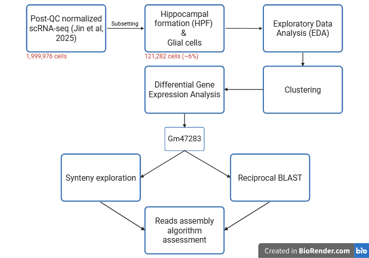
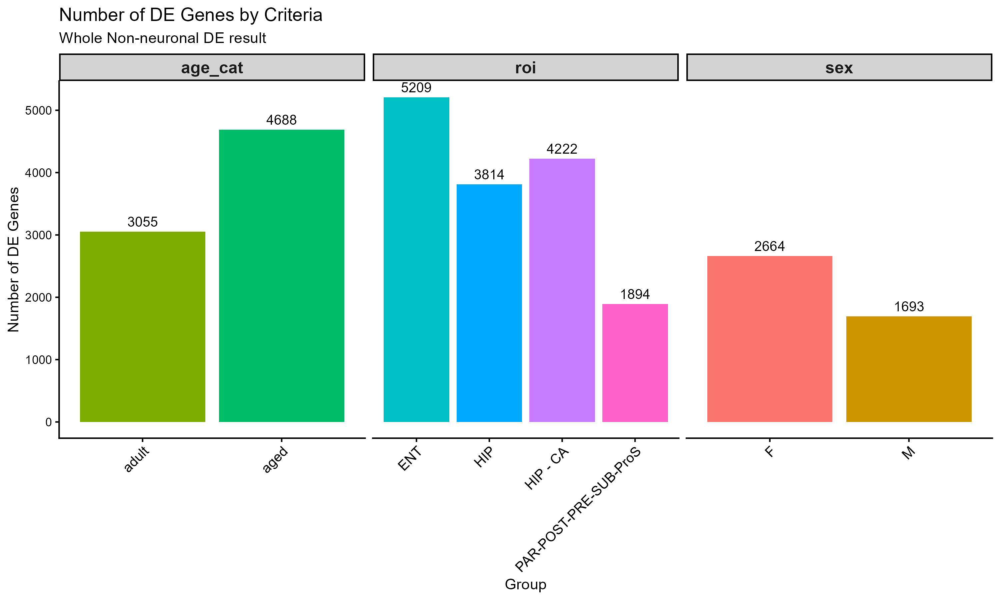
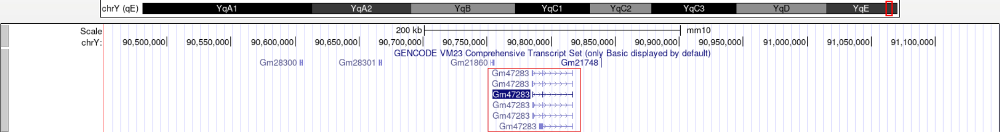
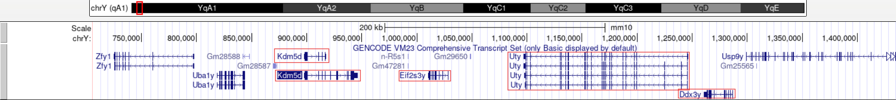
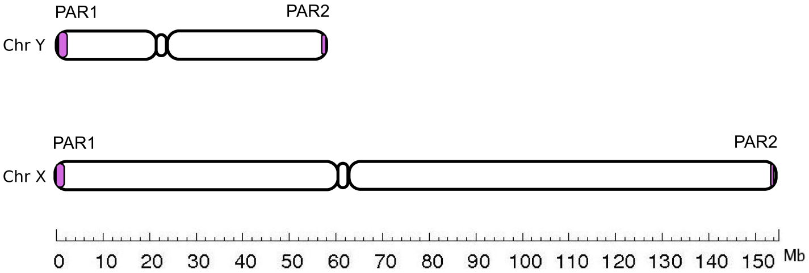
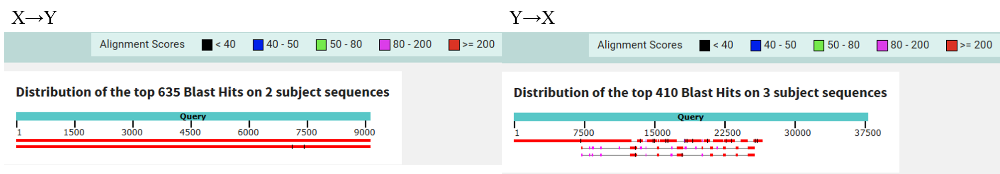
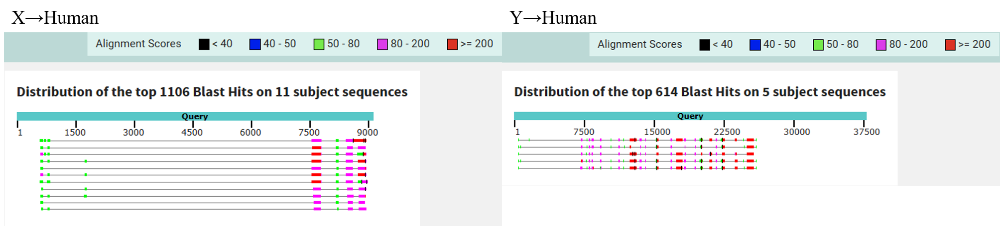

```{=html}
<style>
body {
  font-size: 16px;
}

caption {
  font-size: 14px;
  font-style: italic;
  caption-side: bottom;
}
</style>
```

```{r setup, include=FALSE, echo=FALSE}
knitr::opts_chunk$set(
                      warning = FALSE, # suppressing warning messages
                      message = FALSE,
                      knitr.kable.max_rows = 5)
```

# Introduction

Single-cell RNA sequencing (scRNA-seq) has transformed our ability to characterize cellular heterogeneity. Within current bioinformatic pipelines, clustering and cell type annotation represent critical steps for translating raw count matrices into biologically meaningful information ([He et al., 2022](https://doi.org/10.52601/bpr.2022.210041)). Currently, researchers rely on two primary methodologies for cell-type annotation: manually identifying populations via established marker genes, or automatically mapping the data against a reference transcriptome ([He et al., 2022](https://doi.org/10.52601/bpr.2022.210041); [Heumos et al., 2023](https://doi.org/10.1038/s41576-023-00586-w)). Marker-gene-based annotation is biologically robust but relatively slow and typically yields low-resolution classifications. Conversely, reference-based mapping can rapidly generate high-resolution annotations. The critical caveat is that the robustness of these automated annotations depends heavily on the robustness of the selected reference transcriptome.

)](figure/scRNA_seq_pipeline.jpg)

<br>

One widely used reference transcriptome is the [Allen brain atlas](https://mouse.brain-map.org/). In their 2025 update ([Jin et al., 2025](https://doi.org/10.1038/s41586-024-08350-8)), sequenced 108 mice (44 aged, 64 adult; 51 female, 57 male), yielding approximately 2 million cells after quality control, covering ~35% of the whole mouse brain volume, making it the highest-coverage atlas at the time of publication. While this atlas provides an invaluable resource, we suspect that standard clustering pipelines, including those utilized by the Allen Brain Atlas, are vulnerable to two major computational flaws. First, performing global clustering without stratifying by fundamental biological variables (such as sex, age, and region) risks masking state-specific transcriptional differences, diluting biologically important signals and generating false negatives. Second, algorithms that favour high-resolution clustering may produce over-clustering, mathematically generating small, rare clusters from noise that can be interpreted as "novel" cell types, resulting in false positive.

To rigorously test the robustness of Allen brain atlas's cell type annotation, this project evaluates the glial cell population, known to be heterogeneous and transcriptionally dynamic ([Sun et al., 2021](https://doi.org/10.1007/s10571-021-01159-3); [Sadick et al., 2022](https://doi.org/10.1016/j.neuron.2022.03.008)), making them an ideal population to exposing annotation limitations. Three biological variables known to drive transcriptomic shifts (sex, age, and region) were selected. Sex is known to drive transcriptomic changes due to genetic and hormonal differences ([Szadvári et al., 2023](https://doi.org/10.1016/j.physbeh.2022.114038)), with studies reporting stronger microglial activation in female Alzheimer's disease (AD) cases ([Kodama & Gan, 2019](https://doi.org/10.1016/j.molmed.2019.05.001)). Age is the primary risk factor for neurodegenerative diseases, driving common transcriptomic changes that include chronic inflammation and mitochondrial dysfunction ([Hou et al., 2019](https://doi.org/10.1038/s41582-019-0244-7); [Mattson & Arumugam, 2018](https://doi.org/10.1016/j.cmet.2018.05.011)). Finally, the hippocampal formation (HPF) was selected as the region of interest because it is highly vulnerable and frequently affected in various neurodegenerative diseases ([Davidson & Stevenson, 2024](https://doi.org/10.3390/ijms25041991)), while also exhibiting sex-specific functional differences ([Yagi & Galea, 2019](https://doi.org/10.1038/s41386-018-0208-4)).

# Objective

First, explore sex- and age-related transcriptomic signatures defining the non-neuronal (glial) populations’ identity within the Hippocampal formation (HPF). Second, investigate a profound transcriptomic anomaly: determining Why *Gm47283*, a Y-linked gene, significantly upregulated in the transcriptomic profiles of female *Mus musculus*.

# Method



## Animal Model

Mouse breeding and tissue sampling were conducted by [Jin et al., (2025)](https://doi.org/10.1038/s41586-024-08350-8).

The dataset derives from 108 wild-type C57BL/6J mice, explicitly stratified by age and sex. Specifically, consists of 44 aged mice (20 female, 24 male) euthanized between postnatal days (P) 540 and 553 (approximately 18 months), alongside 64 adult mice (31 female, 33 male) euthanized between P53 and 69 (approximately 2 months).

Animals presenting with gross health abnormalities were excluded prior to sequencing, and tissue collections were standardized within a 3-hour Zeitgeber window to minimize circadian variance. Notably, while the dataset is highly stratified by sex, the oestrous cycles of the female mice were not tracked during tissue collection. This is a relevant biological limitation when attempting to isolate baseline sex-driven transcriptomic variance, as oestrous cycle phase can substantially influence hippocampal gene expression ([Yagi & Galea, 2019](https://doi.org/10.1038/s41386-018-0208-4)).

## Data Source

The single-cell RNA sequencing (scRNA-seq) data utilized in this study was originally generated by [Jin et al., (2025)](https://doi.org/10.1038/s41586-024-08350-8). The complete dataset is publicly deposited in the [Neuroscience Multi-omic Data Archive (NeMO)](https://assets.nemoarchive.org/dat-61kfys3) and was retrieved via their direct archive [link](https://data.nemoarchive.org/other/grant/Mouse_Aging/zeng/transcriptome/scell/10x_v3/mouse/processed/counts/Mouse_Aging_10Xv3_normalized_20241115.h5ad.tar). Note that only the cellular data specifically derived from the Hippocampal formation (HPF) was extracted and subjected to downstream analysis.

[Jin et al., (2025)](https://doi.org/10.1038/s41586-024-08350-8) sequenced brain sample collected from 44 aged mice (20 female, 24 male) and 64 young adult mice (31 female, 33 male) using Illumina NovaSeq6000 sequencing system ([Modi et al., 2021](https://doi-org.myaccess.library.utoronto.ca/10.1007/978-1-0716-1099-2_2)) and 10X Genomics CellRanger pipeline (v.6.0.0) to map sequenced reads to **mm10/gencode.vM23** reference genome ([Frankish et al., 2019](https://doi-org.myaccess.library.utoronto.ca/10.1093/nar/gky955)). The dataset contains **2,777,165** cells categorized across 16 subregions within 6 major regions: the isocortex, hippocampal formation (HPF), hypothalamus (HY), cerebral nuclei (CNU), midbrain, and hindbrain.

## Packages Usage

[Seurat](https://satijalab.org/seurat/) ([Hao et al., 2023](https://satijalab.org/seurat/)) was used as the primary analytical framework.

The following table categorized R packages utilization by biological analysis, data visualization, and pipeline utilities within this project based on their primary functionality.

| Category | Package | Version | Description | Reference |
| :--- | :--- | :--- | :--- | :--- |
| Analytical | `Seurat` | *5.4.0* | Basic framework for data management, Differential Gene Expression (DEG) analysis, and Umap visualization | [Hao et al., 2023](https://satijalab.org/seurat/) |
| Analytical | `scrattch.bigcat` | *0.0.1* | Initially selected for clustering, the same package utilized by [Jin et al., 2025](https://doi.org/10.1038/s41586-024-08350-8). **Note:** Utilization was unsuccessful due to limited documentation and local compatibility issues. | Unpublished; [github](https://github.com/AllenInstitute/scrattch.bigcat) |
| Analytical | `scrattch.hicat` | *1.0.0* | Alternative clustering package utilized; selected for superior documentation. | Unpublished; [github](https://github.com/AllenInstitute/scrattch.hicat) |
| Analytical | `Presto` | *1.0.0* | Fast implementation of Wilcoxon Rank Sum test | [Nathan & Raychaudhuri, 2019](https://doi.org/10.1101/653253) |
| Visualization | `ggplot2` | *4.0.1* | Exploratory Data Analysis (EDA); visualization of cell subclass, ROI, sex, age, and doublet scores. | [Wickham, 2016](https://ggplot2.tidyverse.org) |
| Visualization | `patchwork` | *1.3.2* | Plots Composer | [Pedersen, 2025](https://patchwork.data-imaginist.com) |
| Utilities | `annadataR` | *1.0.0* | Data loading; converting Python-native `.h5ad` formats into R-compatible Seurat objects. | [Deconinck et al., 2026](https://doi.org/10.1101/2025.08.18.669052) |
| Utilities | `bookdown` | *0.46* | HTML report formatting and generation. | [Xie, 2016](https://bookdown.org/yihui/bookdown) |
| Utilities | `knitr` | *1.51* | R Markdown environment configuration and dynamic table rendering. | [Xie, 2014](https://yihui.org/knitr/) |
| Utilities | `Matrix` | *1.7-3* | Sparse and Dense Matrix data manipulation  | [Bates et al., 2025](https://doi.org/10.32614/CRAN.package.Matrix) |
| Utilities | `devtools` | *2.4.6* | Grant developer mode for R packages, tuning `scrattch.bigcat` and `scrattch.hicat`  | [Wickham et al., 2025](https://doi.org/10.32614/CRAN.package.devtools) |

**Table 1:** Summary of R packages utilized for data processing, analysis, and document generation. Packages are categorized by their primary functional role within the bioinformatics pipeline (Analytical, Visualization, or Utilities). Note that the original clustering package, scrattch.bigcat, was substituted with scrattch.hicat due to local environment incompatibilities and insufficient documentation.

## Normalization and Quality Control

The normalization and quality control step were conducted by [Jin et al., (2025)](https://doi.org/10.1038/s41586-024-08350-8). The raw counts were log-transformed and z-score normalized. Cells which number of gene detected < 1000 OR QC score < 50 OR Doublet score > 0.3 were removed.

## Data loading and Sub-setting

The downloaded data is in `.h5ad`, popular single-cell transcriptome format in Python ecosystem. [annadataR](https://doi.org/10.1101/2025.08.18.669052) was utilized to read `.h5ad` file into R and converted to `Seurat object`, basic functional unit in [Seurat](https://satijalab.org/seurat/) pipeline. Then subset the whole HPF dataset by neuro/glia, age, sex, sub-region (ROI) subsets for the sake of data management.


)](figure/allen_region.png)


)](figure/allen_annotation.png)

## Exploratory Data Analysis

[ggplot2](https://ggplot2.tidyverse.org/) was utilized for visualization. Cell sub_class, region of interest (ROI), sex, age, number of detected gene, number of gene count, mitochondrial percentage and Doublet_score, one of the quality control score utilized by [Jin et al., (2025)](https://doi.org/10.1038/s41586-024-08350-8), proposed by [McGinnis (2019)](https://doi.org/10.1016/j.cels.2019.03.003), were plotted and examined.

## Clustering

Hierarchical clustering of the non-neuronal (glial) expression matrix was performed using the `scrattch.hicat` package. Differential expression parameters were defined as `q1.th = 0.4`, `q.diff.th = 0.7`, and `de.score.th = 300`, identical to [Jin et al., (2025)](https://doi.org/10.1038/s41586-024-08350-8). The minimum cell threshold was reduced to 50 (`min.cells = 50`) from the original study's 100 to appropriately accommodate the smaller cell volume of the HPF, non-neuronal subset. 

Preliminary clustering was executed via `iter_clust()` function (sample size = 10,000, `max.cl.size = 200`, `split.size = 50`). Consensus clusters were subsequently finalized using the `merge_cl()` function on a representative sample of 100 cells per preliminary cluster. 

Finally, the consensus `hicat` cluster identities were integrated into the Seurat object metadata. For visualization, highly variable features were scaled prior to Principal Component Analysis (PCA), and Uniform Manifold Approximation and Projection (UMAP) was generated using the first 30 principal components (`dims = 1:30`).

## Differential Gene Expression Analysis

Differentially expressed genes (DEGs) were identified utilizing [Seurat](https://satijalab.org/seurat/)'s `FindAllMarkers()` function across three categories: sex, age, and region of interest (ROI, which contains Entorhinal cortex, Hippocampus, Cornu Ammonis, and Hippocampal-subicular). To capture both broad and cell-subtype specific transcriptomic shifts, DEGs were identified on two scales: globally across the integrated non-neuronal dataset, and locally within isolated glial subclasses. Only significantly upregulated DEGs were identified (`only.pos = TRUE`) using Wilcoxon Rank Sum test implemented in [presto](https://doi.org/10.1101/653253) package (`test.use = "wilcox"`), applying a minimum log-fold change threshold of 0.1 (`logfc.threshold = 0.1`) and a minimum cellular detection fraction of 0.01 (`min.pct = 0.01`). If a subclass contained fewer than two comparator groups within a specific category, this (subclass, category) pair DEGs identification was skipped.

| Scope (Analyzed Population) | Sex Category | Age Category | ROI Category^[a]^ |
| :--- | :--- | :--- | :--- |
| Global (All subclass) | Male vs Female | Adult vs Aged | HPF Sub-region Comparisons |
| Local Subclass 1 | Male vs Female | Adult vs Aged | Sub-region Comparisons |
| Local Subclass 2 | Male vs Female | Adult vs Aged | Sub-region Comparisons |
| Local Subclass 3 | Male vs Female | Adult vs Aged | Sub-region Comparisons |
| **... (Iterated for all n=14 unique subclasses)** | ... | ... | ... |

**Table 2:** Schematic of multi-axial Differential Expression (DE) comparison matrix. The table summarizes the systematic methodology employed to identify transcriptionally dynamic genes across non-neuronal cells of the hippocampal formation (HPF). ^[a]^ Regional (ROI) comparisons included contrasts between four major HPF anatomical structures: the entorhinal cortex (ENT), hippocampus (HIP), cornu ammonis (HIP-CA), and the hippocampal-subicular (PAR_POST_PRE_SUB_ProS).

To control for inherent differences in baseline transcriptional complexity when comparing the total number of DGEs between distinct cellular subclasses, absolute DGE counts were normalized. Raw DGE counts were converted into percentages relative to two transcriptomic baseline metrics: the average number of detected genes per cell within a specific subclass, and the union of all expressed genes across that subclass.

Finally, the top 15 DEGs identified in each comparison (ranked by ascending adjusted p value) were extracted for manual investigation.

## Synteny Exploration

To investigate the genomic location and syntenic relationships of the identified candidate DEGs, spatial coordinates were visually inspected utilizing the [UCSC Genome Browser](https://pubmed.ncbi.nlm.nih.gov/41251146/). The *Mus musculus* reference genome `GRCm38/mm10`, provided by the [Genome Reference Consortium](https://www.ncbi.nlm.nih.gov/grc), was selected to align with [Jin et al., (2025)](https://doi.org/10.1038/s41586-024-08350-8). Five specific genes of interest (*Kdm5d*, *Eif2s3y*, *Uty*, *Ddx3y*, and *Gm47283*) were manually queried using the UCSC Genome Browser's website search tool to evaluate their synteny.

## Reciprocal BLAST

To assess the sequence homology between the X and Y alleles of *Gm47283*, an intra-species reciprocal BLAST strategy was employed. The genomic sequences for both alleles were fetched from the Mouse Genome Informatics (MGI) database (Accession IDs: [MGI:2384747](https://www.informatics.jax.org/marker/MGI:2384747) for the X allele; [MGI:6096131](https://www.informatics.jax.org/marker/MGI:6096131) for the Y allele). These sequences were subsequently utilized as independent queries in the Nucleotide BLAST (BLASTN) algorithm via the National Center for Biotechnology Information (NCBI) web interface ([Sayers et al., 2025](https://doi.org/10.1093/nar/gkae979)). Searches were conducted against the core nucleotide collection (`core_nt`) database, with the search space strictly filtered to include only *Mus musculus* taxa (taxid:10090). The resulting alignments were manually evaluated to determine whether the *Gm47283* X and Y chromosomal loci emerged as reciprocal top hits, thereby assessing the validity of their sequence similarity.

To determine whether the murine *Gm47283* gene possesses conserved evolutionary counterparts within the human genome, an inter-species homology search was subsequently conducted. All sequence inputs and algorithm parameters were kept identical to the intra-species search, with the taxonomic search space strictly filtered to include only *Homo sapiens* (taxid:9606). The resulting alignments were manually evaluated to identify potential human homologs.

# Result

## Data Loading and Sub-setting

The Post-QC normalized scRNA-seq data obtained from the [Neuroscience Multi-omic Data Archive (NeMO)](https://assets.nemoarchive.org/dat-61kfys3) contained **1,999,976** cells. After sub-setting to non-neuronal cells in the HPF, **121,282** cells (~6.06%) remained.

## Exploratory Data Analysis

There were 16 subclasses in the dataset, dominated by `Astro-TE NN` (43.7%). There were 4 sub-HPF region (denote as region of interest, ROI in figure 5) revealed from dataset. However, [Jin et al., (2025)](https://doi.org/10.1038/s41586-024-08350-8) only document three ROI as shown in figure 3, `HIP` wasn't documented. Judged by the same prefix of `HIP` and `HIP - CA` It was supposed to be part of `HIP - CA`. 

The sex distribution was slightly biased toward males, and the age distribution was biased toward aged group.


## Clustering

The clustering results were broadly consistent with the subclass annotations. However, four small clusters (20, 24, 25, 26), located at the boundary between the OPC and oligodendrocyte populations, were identified by clustering but were absent from the subclass annotations. Given that oligodendrocytes differentiate from OPCs ([Tiane et al., 2019](https://doi.org/10.3390/cells8101236)), these four clusters (20, 24, 25, 26) may represent intermediate differentiation states along the OPC-to-oligodendrocyte lineage.

Visual assessment of the UMAP projections indicates that among the three metadata variables, ROI drives the most pronounced transcriptomic heterogeneity, particularly within astrocytic populations. Age serves as the secondary driver of variance, predominantly segregating astrocyte and oligodendrocyte clusters, whereas biological sex exerts the subtlest visual influence.


## Differential Gene Expression Analysis

The number of globally differentially expressed genes (DEGs) aligned with the UMAP visualization, with both indicating that ROI is the strongest contributor to transcriptomic heterogeneity, followed by age and sex.



<br>

Comparing raw DEG counts with normalized counts, the overall patterns were preserved. Compare different subclasses within a raw/normalized count panel, astrocyte revealed to be the most heterogeneous subclass, followed by oligodendrocyte. Compare different categories (sex, age, ROI) within a subclass, the result aligned with UMAP visualization and global result which all indicate ROI is the strongest contributor to cell heterogeneity followed by age and sex. Only Ependymal subclass diverges from the ROI, age, sex pattern of contribution, but weakly and based on an insufficient number of tested cells.


<br>

Among the top 15 DEGs identified in each subclass during sex comparisons, *Gm47283* was significantly upregulated in the female group across 10 of the 16 subclasses. Although the magnitude of the fold change was modest, the statistical significance of this differential expression was extremely high. Interestingly, according to [UCSC Genome Browser](https://www.genome.ucsc.edu/cgi-bin/hgGene?hgg_gene=ENSMUST00000177671.7&hgg_prot=uc292van.1&hgg_chrom=chrY&hgg_start=90785500&hgg_end=90816464&hgg_type=knownGene&db=mm10&hgsid=1920644492_dMBWtAa75dxnVBVsaTcAHLCeLOll), *Gm47283* was documented as Y-linked gene. Given that the sex chromosome configuration in female mouse is XX, it's biologically implausible for a Y-linked gene to show upregulation in female group.


<br>

Conversely, the other four differentially expressed Y-linked gene (*Kdm5d*, *Eif2s3y*, *Uty*, *Ddx3y*, and *Gm47283*) were expressed exclusively in the male group, as expected.


## Synteny Exploration

All five genes of interest (*Kdm5d*, *Eif2s3y*, *Uty*, *Ddx3y*, and *Gm47283*) are located at the two telomeric ends of the Y chromosome. Among them, the four genes significantly upregulated in the male group (*Kdm5d*, *Eif2s3y*, *Uty*, and *Ddx3y*) are clustered in close proximity to one another at one telomeric end. Conversely, *Gm47283* is located in isolation at the opposite telomeric end





<br>

Existing literature indicates that the telomeric ends of the X and Y chromosomes are defined as pseudoautosomal regions (PARs) in both human ([Graves & Toder, 1998](https://doi.org/10.1093/hmg/7.13.1991)), and mouse ([Perry et al., 2001](https://doi.org/10.1101/gr.203001)). Genes within PARs undergo homologous pairing and recombination during meiosis, similarly to autosomal loci. Consequently, genes within the pseudoautosomal regions are homologous and share high sequence similarity between the X and Y chromosomes.



## Reciprocal BLAST

The *Gm47283* X-allele query yielded 2 Y-chromosome hits within the top 3 hits, demonstrating an E-value of 0, 98~99% sequence identity, and 100% query coverage ([Supplementary Figure 1](https://github.com/DDMMMAA/scrattch.hicat-BCB430-/blob/master/report/figure/X_to_Y_BLAST.png)). Conversely, the Y-allele query yielded 3 X-chromosome hits within the top 17 hits, also demonstrating an E-value of 0 and ~98% sequence identity. Among these X-chromosome hits, one exhibited 61% query coverage, while the remaining two exhibited ~13% query coverage ([Supplementary Figure 2](https://github.com/DDMMMAA/scrattch.hicat-BCB430-/blob/master/report/figure/Y_to_X_BLAST.png)). In both directions, the mapped sequences were nearly identical. The difference in query coverage indicates that the Y-allele is relatively large compared to the X-allele. This size difference is verified by the graphical visualization, which reveals multiple truncations when mapping Y-allele to X-allele.



<br>

The interspecies BLAST analysis revealed sequences similarity to *Gm47283* located on human chromosome 21. The Y-allele query yielded 5 human chromosome 21 hits within the top 5 hits, demonstrating an E-value of 0, 93~97% sequence identity, and 10~17% query coverage ([Supplementary Figure 3](https://github.com/DDMMMAA/scrattch.hicat-BCB430-/blob/master/report/figure/Y_to_Human_BLAST.png)). The X-allele query yielded 11 human chromosome 21 hits within the top 11 hits, demonstrating an E-values ranging from 1e-43 to 5e-61, 81~90% sequence identity, and 7~12% query coverage ([Supplementary Figure 4](https://github.com/DDMMMAA/scrattch.hicat-BCB430-/blob/master/report/figure/X_to_Human_BLAST.png)). The graphical representation indicates extensive fragmentation and truncation in both queries. The combination of high sequence identity, low query coverage, and extensive truncation implies the existence of a human paralog of *Gm47283* residing on chromosome 21.



## Read Mapping Algorithm Assessment

To evaluate the potential for algorithmic artifacts contributing to the potential *Gm47283* mismapping, the foundational read mapping pipeline utilized by [Jin et al., (2025)](https://doi.org/10.1038/s41586-024-08350-8) was critically assessed. According to the original study's methodology, read mapping was executed using the 10x Genomics [Cell Ranger pipeline (v.6.0.0)](https://www.10xgenomics.com/support/cn/software/cell-ranger/latest/algorithms-overview/cr-gex-algorithm). Cell Ranger further employed the Spliced Transcripts Alignment to a Reference (STAR) algorithm ([Dobin et al., 2013](https://www.ncbi.nlm.nih.gov/pubmed/23104886)) to map sequenced reads to the reference genome. 

The STAR aligner employs a local scoring model that penalises mismatches, insertions, and deletions proportionally. While STAR natively permits user-defined handling of multimapped reads (reads that mapped to multiple genomic loci with equal scoring confidence), the standard Cell Ranger pipeline discards all multimapped reads during quality control ([10X Genomics Q&A documentation](https://kb.10xgenomics.com/s/article/4409878456077-How-to-extract-multi-mapped-reads-from-Cell-Ranger-BAM-files)). This algorithmic parameter was identified as a potential vulnerability when evaluating highly homologous loci, as true reads originating from the *Gm47283* X and Y alleles would likely be discarded.

# Discussion

This project rigorously evaluated the robustness of cell annotation from Allen brain atlas ([Jin et al., 2025](https://doi.org/10.1038/s41586-024-08350-8)), utilizing the non-neuronal (glial) populations of the Hippocampal Formation (HPF) to expose potential limitations. The experimental workflow involved clustering the HPF glial subset, executing multi-axial differential gene expression (DGE) analyses across subregions (ROI), age, and biological sex, and investigating a profound sex-linked transcriptomic anomaly, *Gm47283*'s upregulation in female. By systematically stratifying the data by fundamental biological variables, this study highlights how unresolved genomic and algorithmic complexities can introduce critical transcriptomic biases into scRNA-seq analyses.

## Region, Age, and Sex Drives HPF Glial Heterogeneity

Our clustering and differential gene expression analysis revealed that within the HPF non-neuronal population, sub-regional location (ROI) drove the most profound transcriptomic variance, followed by age, while biological sex exerted the subtlest global effect (Figures 6~8). These variances align well with current neurobiological literature. Astrocytes are known to exhibit high regional heterogeneity, adapting locally to the distinct metabolic and synaptic demands of specific microenvironments, such as the entorhinal cortex versus the hippocampus ([Bocchi et al., 2025](https://doi.org/10.1038/s41593-025-01878-6), [Schroeder et al, 2025](https://doi.org/10.1016/j.neuron.2025.09.011)). Age is also an expected biological outcome, reflecting the chronic inflammatory shifts and metabolic dysfunction characteristic of aging glial populations ([Hou et al., 2019](https://doi.org/10.1038/s41582-019-0244-7); [Mattson & Arumugam, 2018](https://doi.org/10.1016/j.cmet.2018.05.011)).

While sex contributed the least to global transcriptomic heterogeneity among the tested variables, multi-axial analysis effectively identified significant sex-specific markers. As expected, *Kdm5d*, *Eif2s3y*, *Uty*, and *Ddx3y* were exclusively expressed in males. However, the analysis also revealed a anomalous, significant upregulation of *Gm47283*, an annotated Y-linked gene, in female across 10 of 16 glial subclasses.

## The Gm47283 Transcriptomic Anomaly

### Characterization of Gm47283

*Gm47283* is documented in [UCSC Genome Browser](https://www.genome.ucsc.edu/cgi-bin/hgGene?hgg_gene=ENSMUST00000177671.7&hgg_prot=uc292van.1&hgg_chrom=chrY&hgg_start=90785500&hgg_end=90816464&hgg_type=knownGene&db=mm10&hgsid=1920644492_dMBWtAa75dxnVBVsaTcAHLCeLOll), GRCm38/mm10 reference genome, as an isolated, Y-linked gene located at the telomeric end of the chromosome. Biologically, a Y-linked gene cannot be actively transcribed in a female (XX) organism. However, the multi-axial DGE analysis demonstrated its highly significant presence in female. Following the synteny exploration (Section 4.5) and the reciprocal BLAST analysis (Section 4.6), which confirmed near-identical sequence similarity (98~99%) between the *Gm47283* X and Y alleles, it became evident that the presence of *Gm47283* in female was not a biological phenomenon, but a computational artifact.

### Pseudoautosomal Region (PAR) Mismapping Hypothesis and Literature Impact

The telomeric ends of sex chromosomes contain pseudoautosomal regions (PARs), which undergo homologous recombination during meiosis and consequently share high sequence similarity ([Graves & Toder, 1998](https://doi.org/10.1093/hmg/7.13.1991), [Perry et al., 2001](https://doi.org/10.1101/gr.203001)). Because STAR aligner algorithms ([Dobin et al., 2013](https://www.ncbi.nlm.nih.gov/pubmed/23104886)) operate on linear assumptions, they struggle to distinguish true chromosomal origins across highly similar sequences. We hypothesize that a mature, spliced isoform transcribed non-linearly from the X-allele is being erroneously mapped linearly to the continuous Y-allele by the STAR aligner ([Dobin et al., 2013](https://www.ncbi.nlm.nih.gov/pubmed/23104886)).

![**Figure 19:** Proposed mechanism of *Gm47283* reads mismapping. The schematic illustrates a hypothetical algorithmic error during the reads mapping phase of *Gm47283*. The true genomic locus of the *Gm47283* X-allele (top) consists of defined exonic regions (boxes) separated by intronic sequences (lines). Transcription and splicing produce a mature isoform devoid of introns (middle). The hypothesis proposes that this processed, continuous isoform was mapped to continuous Y-allele (bottom) under linear assumption of mapping algorithm, resulting in a mismapping. (created in https://BioRender.com)](figure/hypothetical_mismapping.png)

<br>

This mapping artifact exposes a technical vulnerability in the literature at large. *Gm47283* is unlikely to be the only gene suffering from this algorithmic flaw. Mismappings within PARs, or other highly similar loci between alleles assembled in such linear and non-linear fashion, systematically corrupt the underlying count matrices to certain extent. Inherently, a problematic count matrix yields biased clustering, cell type deconvolution, and generates false-positive and false-negative differential expression markers. This is directly evidenced in the original study by [Jin et al., (2025)](https://doi.org/10.1038/s41586-024-08350-8), where the failure to explicitly stratify by sex led to *Gm47283* being misidentified and published as a "age-associated DEG".

; Y-axis is the number of DEGs; X-axis is subclasses or supertypes; The red box indicate *Gm47283* ([Jin et al., 2025](https://doi.org/10.1038/s41586-024-08350-8), figure 1h)](figure/Allen_gm47283.jpg)

## Future Directions

To validate the proposed *Gm47283* mismapping hypothesis, we propose the following computational (dry) and experimental (wet) methodologies.

For the computational validations, the first step is an X and Y allele pairwise alignment. Conducting a more accurate, localized pairwise alignment between the *Gm47283* X and Y alleles will complement the reciprocal BLAST results. Because BLAST searches for similar sequences across a large database, it employs algorithmic trade-offs (including small seed sizes and selective extension) to balance sensitivity with computational efficiency. Next, an isoform-to-allele pairwise alignment can be performed. Aligning known X-allele isoforms against the two genomic allele sequences will determine if there exists an isoform that aligns non-linearly against the X-allele but linearly against the Y-allele. This would directly test whether the hypothesized mismapping isoform exists among known X-allele transcripts. Finally, re-map the raw female reads to an X-only reference genome. By excluding the Y chromosome from the reference genome and re-aligning the reads to this X-only reference genome, the hypothesis can be tested. If the hypothesis is true, the X-only reference genome will force any ambiguous PAR reads, including the hypothetical *Gm47283* isoform, to their true biological origin on the X chromosome. Thus, the corresponding X-allele count will drastically increase when compared to the Y-contained counts.

For the experimental (wet) validation, Fluorescence In Situ Hybridization (FISH) can be employed. This methodology utilizes fluorescent probes targeting the *Gm47283* transcript co-stained with X and Y chromosome DNA paints in male HPF tissue. If the hypothesis is true, two fluorophores should be observed in the male tissue since both the X and Y alleles are transcribing *Gm47283*.

In addition, it's also interesting to investigate whether there is anything uniquely significant about the hypothetical isoform compared to other isoforms. Considering that this isoform can be actively transcribed from both the X and Y alleles despite their structural truncation differences, it strongly implies that the resulting transcript is biologically indispensable for both males and females.

While the standard local linear assumption utilized by short-read aligners like STAR is computationally efficient and biologically valid for the vast majority of autosomal and non-PAR assemblies, it fundamentally fails within edge cases like PAR. To resolve this, future pipeline development can specifically tune PAR and sex-linked read assembly using targeted non-linear mapping models. Existing non-linear frameworks, such as the affine gap penalty model ([Zachariah et al., 2005](https://doi.org/10.1002/prot.20299)), are already developed and can be selectively deployed and weighted for pre-filtered X and Y chromosome linkage and loci. By deliberately integrating these locus-aware algorithmic controls, the structural mapping artifacts can be eliminated, thereby establishing a more reliable scRNA-seq framework capable of accurately capturing PAR gene expression dynamics and sex-associated biological signals.

## Limitations

A computational limitation within this study must be acknowledged. [Jin et al., (2025)](https://doi.org/10.1038/s41586-024-08350-8) conducted clustering using unpublished, in-house developed R package `scrattch.bigcat (v.0.0.1)` (https://github.com/AllenInstitute/scrattch.bigcat), which is a sub-package of `scrattch` package (https://alleninstitute.github.io/scrattch/) optimized for extremely large single-cell datasets by supporting parallel computing and in-disk data access. However, because [scrattch.bigcat (v.0.0.1)](https://github.com/AllenInstitute/scrattch.bigcat) wasn't formally released, it was poorly documented and failed to execute reliably within the local computational environment despite extensive troubleshooting. Thus, an alternative sub-package of [scrattch](https://alleninstitute.github.io/scrattch/), `scrattch.hicat` (https://github.com/AllenInstitute/scrattch.hicat), was utilized in this project for clustering. [scrattch.hicat](https://github.com/AllenInstitute/scrattch.hicat) doesn't support parallel computing and in-disk data access, but provides better documentation. While both packages employed hierarchical clustering and parameters were matched as closely as possible, differences in algorithmic handling between the two packages may account for minor difference in the reproduction of the smaller boundary clusters.

## Conclusion

Although scRNA-seq remains an invaluable tool for profiling cellular heterogeneity and transcriptomic dynamics, its underlying algorithms exist inherent vulnerabilities. The anomalous mapping of *Gm47283* within female non-neuronal HPF populations exposes the critical limitations of linear read alignment and demonstrates how failing to stratify data by biological sex could generates false-negative conclusions. Ultimately, this investigation proves that robust cell type annotation demands more than advanced clustering algorithms, it also requires more rigorous read mapping model and strict integration of foundational biological variables. Specifically, stratifying datasets by sex, a frequently deprioritized variable, is necessary to isolate true biological variance from computational noise.

# References {#references}

# Supplementary information

[Supplementary Figure 1](https://github.com/DDMMMAA/scrattch.hicat-BCB430-/blob/master/report/figure/X_to_Y_BLAST.png)
Screenshot of X to Y BLAST result

[Supplementary Figure 2](https://github.com/DDMMMAA/scrattch.hicat-BCB430-/blob/master/report/figure/Y_to_X_BLAST.png)
Screenshot of Y to X BLAST result

[Supplementary Figure 3](https://github.com/DDMMMAA/scrattch.hicat-BCB430-/blob/master/report/figure/Y_to_Human_BLAST.png)
Screenshot of Y to Human BLAST result

[Supplementary Figure 4](https://github.com/DDMMMAA/scrattch.hicat-BCB430-/blob/master/report/figure/X_to_Human_BLAST.png)
Screenshot of X to Human BLAST result

